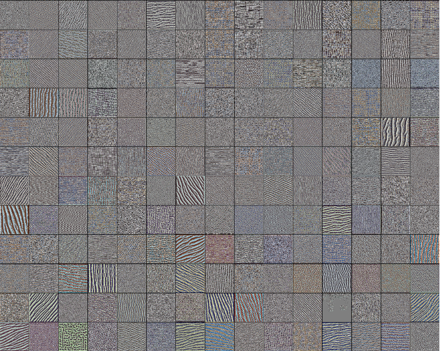
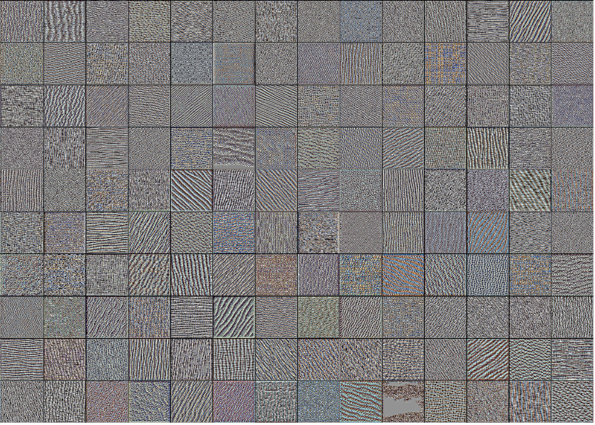
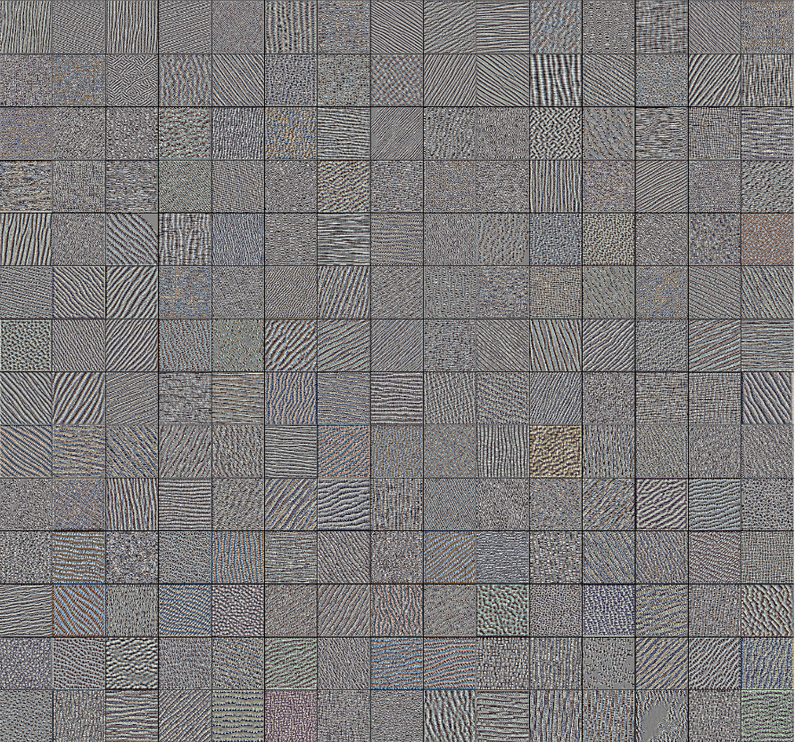
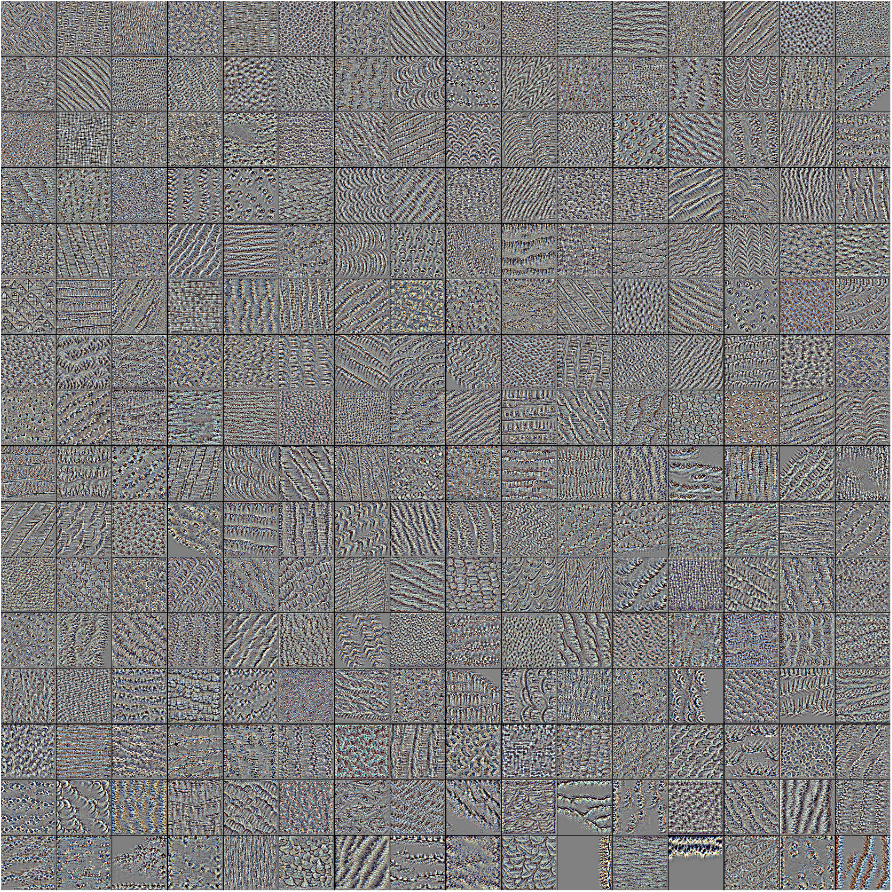

# Visualizing CNN filters and Saliency maps

This repo is about visualizing the various depth of different Pretrained CNN networks like ResNet, VGG16, GoogLeNet since with the accuracy of these models surpassing all the convectional CNNS model for image classification task , it is more important to know what these models learn at their depths and as a latest trend even what these kernels learns  at the depth level is also very important which is seen to be used by different other techniques like Google DeepDream , Neural Style Transfer or may be in the future there may arise new new application like we may actually take last Convolutional layer of model and create average output of all activated neurons of input image and use it for segmentation purpose so that the particular segments can be used like cartoonized effects , Segmentation mapping , etc and the greatest scope I m currently seeing is saliency segmentaiton with out superVision . So Basically this repo is all'bout the visualizing the kernals at every layer of image classifcation models and how we can use this to create Saliency maps: segmentation without Supervision,to implement Neural Style transfer currently in Neural Style transfer we there we use only one layer as content loss and 4 layer of 4th conv block of VGG model as  style loss with visualizing the every layer of each module we may improve the neural style transfer by imploying other content loss and style loss and finally  to implement the google deep dream phenomenon using NN.


``` Method used here for visualization of filter is via Gradient Ascent in the Input Space ```

So Below are the examples of filter visualized of VGG 16 classifier.

1. Generated image of Convolutional Block 1 
* Convolutional layer 1

* Convolutional layer 2


2. Generated image of Convolutional Block 2
* Convolutional layer 1

* Convolutional layer 2


3. Generated image of Convolutional Block 3
* Convolutional layer 1

* Convolutional layer 2

* Convolutional layer 3


4. Generated image of Convolutional Block 4
* Convolutional layer 1

* Convolutional layer 2

* Convolutional layer 3

5. Generated image of Convolutional Block 5
* Convolutional layer 1

* Convolutional layer 2


* Convolutional layer 3


So From Above Picture we can see that as we go deeper into the convolutional block , more small and samall shape is learned where as on the few fort block of convolutional layer only learn the overall texture of image which means if we are implementing neural style transer using VGG16 model we can use earlier block like Block 1  filter to be our Content matrix and later blocks like Block5 to be our Style matrix.

I used Stanford Lecture Ppt for this repo to visulize filters using Gradient Ascent in the input Space. [Click here for the link](http://cs231n.stanford.edu/slides/2017/cs231n_2017_lecture12.pdf)
There is more cool stuff in the above lecture ppt which I will be trying soon ! Give this repo a star if you really like my work and follow me to get notified of my future works .

Merci !
